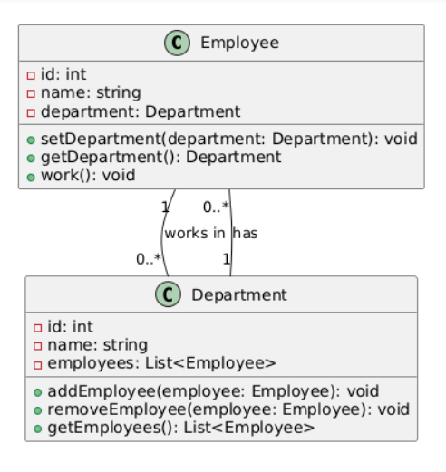
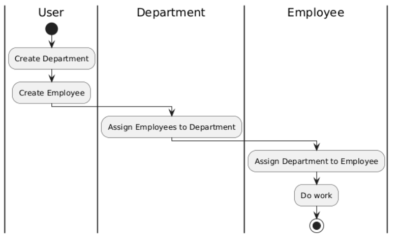

# Лабораторная работа 1 — ООП (C++), согласно варианту №8

## Описание
Этот проект демонстрирует основы объектно-ориентированного программирования в C++. В рамках задания были созданы классы для представления сотрудников и отдела, а также реализованы функции для ввода данных о сотрудниках и их отображения.

Программа позволяет:
- Вводить информацию о сотрудниках с клавиатуры.
- Добавлять сотрудников в отдел.
- Выводить информацию о сотрудниках отдела.

### UML диаграмма классов



### UML диаграмма деятельности




## Структура проекта

- `main.cpp` — основной файл программы, где происходит взаимодействие с пользователем.
- `Employee.cpp` / `Employee.h` — класс `Employee`, который содержит информацию о сотруднике (имя, должность, дата приема).
- `Department.cpp` / `Department.h` — класс `Department`, который управляет сотрудниками и их данными.
- `build` - папка с собранным проектом.

### Готовая сборка
Чтобы просмотреть уже собранный проект, запустите `build/program.exe`;

### Как пересобрать проект
Для того, чтобы пересобрать проект воспользуйтесь инструкцией:
1. Убедитесь, что у вас установлен **g++** (MinGW или другая версия компилятора для Windows).
2. Скачайте проект и откройте его в **VS Code**.
3. Откройте терминал в VS Code и выполните команду для сборки:
   ```bash
   g++ *.cpp -o lab1.exe

- [Ссылка на инстукцию по запуску C++ проектов на Windows](https://github.com/adam-p/markdown-here/wiki/Markdown-Cheatsheet#links)
- [Ссылка на инстукцию по запуску C++ проектов на Linux](https://code.visualstudio.com/docs/cpp/config-linux)

### Комфортная разработка
После Настройки `vs code` на поддержку C++ проектов, вы можете настроить `tasks.json` для
комфортной разработки:
- для комфортной разработки и отладки рекомендуется опредеделить `tasks.json`:
- Затем воспользовать `Debug/Run C++ File` в vs code;
- В `tasks`, поле `"args"` указываются cpp файлы проекта.

`tasks.json`:

```json
{
    "version": "2.0.0",
    "tasks": [
        {
            "type": "cppbuild",
            "label": "C/C++: g++ build all .cpp files",
            "command": "C:\\msys64\\ucrt64\\bin\\g++.exe",
            "args": [
                "-fdiagnostics-color=always",
                "-g",
                "main.cpp",
                "Department.cpp",
                "Employee.cpp",
                "-o",
                "${fileDirname}\\build\\program.exe"
            ],
            "options": {
                "cwd": "${fileDirname}"
            },
            "problemMatcher": [
                "$gcc"
            ],
            "group": {
                "kind": "build",
                "isDefault": true
            },
            "detail": "Компиляция всех cpp-файлов проекта"
        }
    ]
}
```