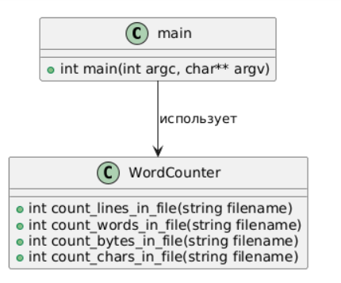
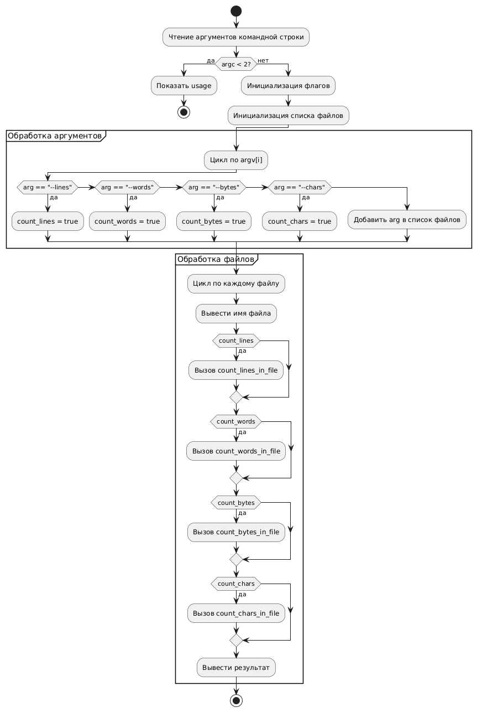

# 💻 Лабораторная работа: Утилита **WordCount** 📝

## 🚀 Примеры запуска программы:

- Запуск с одним файлом:  
  `WordCount.exe filename1.txt`

- Запуск с несколькими файлами:  
  `WordCount.exe filename1.txt filename2.txt`

- Подсчёт слов и строк в файле:  
  `WordCount.exe --words --lines filename1.txt`

- Подсчёт строк и байт в файле:  
  `WordCount.exe -l -c filename1.txt`

- Подсчёт слов, строк и байт в нескольких файлах:  
  `WordCount.exe -lwc filename1.txt filename2.txt`

- Подсчёт строк, байт и слов в нескольких файлах:  
  `WordCount.exe filename1.txt filename2.txt -lw --bytes`

## 📂 Структура проекта

```
│   .gitignore
│   CMakeLists.txt
│   RandomText.txt
│   README.md
│   windows_build_test.bat
│   WordCount.exe
│
├───.vscode
│       launch.json
│       tasks.json
│
├───build
├───images
│       activity.uml.png
│       classes.uml.png
│
└───src
        main.cpp
        word_count.cpp
        word_count.h
```

## 📊 Диаграммы

### 🏗️ Диаграмма классов


### 🔄 Диаграмма деятельности


## 🛠️ Сборка проекта на Windows:

1. Установите [MSYS2](https://www.msys2.org/), если он ещё не установлен.

2. Измените переменную среды `path`, добавив запись `C:\msys64\ucrt64\bin` (подробнее в полезных ссылках).

3. Установите инструменты `MinGW` и `CMake` в `MSYS2` с помощью команд в терминале:
   ```bash
   # Установка MinGW инструментария
   pacman -S --needed base-devel mingw-w64-ucrt-x86_64-toolchain
   # Установка cmake
   pacman -S mingw-w64-ucrt-x86_64-cmake
   ```

4. Закройте `MSYS2`, откройте `PowerShell` или `CMD` и выполните проверку:
   ```bash
   g++ --version
   gdb --version
   gcc --version
   cmake --version
   ```

5. **Если всё успешно**, приступайте к сборке:

- В репозитории есть файл `CMakeLists.txt`.

- Откройте `CMD` или `PowerShell` в директории с файлом `CMakeLists.txt` и выполните команду:
  ```bash
  # Находясь в одной директории с CMakeLists.txt
  cmake -S . -B build -G "MinGW Makefiles"
  ```

- После этого в папке `build` появятся файлы сборки `cmake`.

- Для сборки проекта выполните команду:
  ```bash
  cmake --build build
  ```

- В репозитории появится файл `WordCount.exe`, готовый к запуску.

**Корректный вывод кириллицы**
Чтобы избежать крокозябр на `windows`, после сборки, запустите `windows_build_test.bat` который автоматически запустит `WordCount.exe` с нужными языкоми настройками через консоль, используя `RandomText.txt` в качестве примера.

## 🐧 Для Linux:

Для Linux достаточно использовать `cmake` для сборки, без дополнительных шагов, связанных с MinGW.

```bash
cmake -S . -B build
cmake --build build
```

---

📚 **Полезные ссылки**:
- [Инструкция по запуску C++ проектов на Windows](https://code.visualstudio.com/docs/cpp/config-mingw)
- [Инструкция по запуску C++ проектов на Linux](https://code.visualstudio.com/docs/cpp/config-linux)