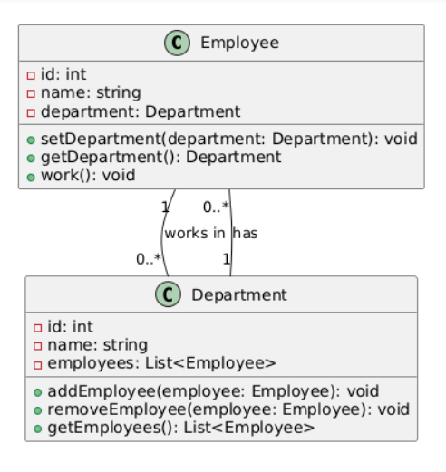
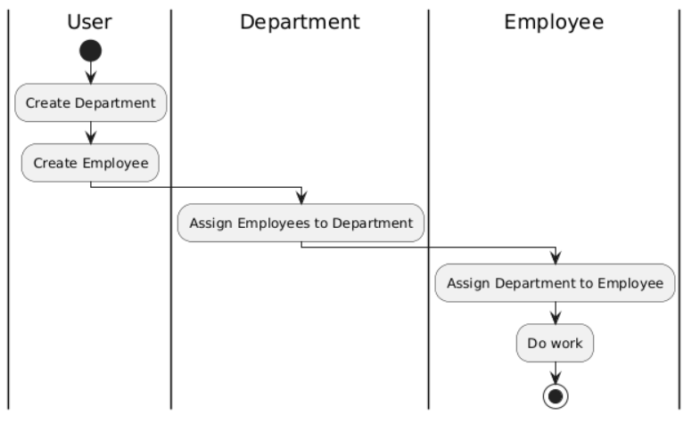

# 🖥️ Лабораторная работа 1 — ООП (C++), согласно варианту №8

## 📋 Описание

Этот проект демонстрирует основы **объектно-ориентированного программирования** в C++. В рамках задания были созданы классы для представления сотрудников и отдела, а также реализованы функции для ввода данных о сотрудниках и их отображения.

Программа позволяет:
- 📥 Вводить информацию о сотрудниках с клавиатуры.
- ➕ Добавлять сотрудников в отдел.
- 📊 Выводить информацию о сотрудниках отдела.

### 📊 UML диаграмма классов


### 🔄 UML диаграмма деятельности


## 📂 Структура проекта

```
│   .gitignore
│   CMakeLists.txt
│   LICENSE
│   README.md
│
├───.vscode
│       settings.json
│       tasks.json
│
├───build
├───images
│       activity.uml.png
│       class.uml.png
│
└───src
        Department.cpp
        Department.h
        Employee.cpp
        Employee.h
        main.cpp
```

## 🛠️ Сборка проекта на Windows:

1. Установите [MSYS2](https://www.msys2.org/), если он ещё не установлен.

2. Измените переменную среды `path`, добавив запись `C:\msys64\ucrt64\bin` (подробнее в полезных ссылках).

3. Установите инструменты `MinGW` и `CMake` в `MSYS2` с помощью команд в терминале:
   ```bash
   # Установка MinGW инструментария
   pacman -S --needed base-devel mingw-w64-ucrt-x86_64-toolchain
   # Установка cmake
   pacman -S mingw-w64-ucrt-x86_64-cmake
   ```

4. Закройте `MSYS2`, откройте `PowerShell` или `CMD` и выполните проверку:
   ```bash
   g++ --version
   gdb --version
   gcc --version
   cmake --version
   ```

5. **Если всё успешно**, приступайте к сборке:

- В репозитории есть файл `CMakeLists.txt`.

- Откройте `CMD` или `PowerShell` в директории с файлом `CMakeLists.txt` и выполните команду:
  ```bash
  # Находясь в одной директории с CMakeLists.txt
  cmake -S . -B build -G "MinGW Makefiles"
  ```

- После этого в папке `build` появятся файлы сборки `cmake`.

- Для сборки проекта выполните команду:
  ```bash
  cmake --build build
  ```

- В репозитории появится файл `Program`, готовый к запуску.

**Корректный вывод кириллицы**
Чтобы избежать крокозябр на `windows`, после сборки, запустите `windows_demo.bat` который автоматически запустит `Program.exe` с нужными языкоми настройками через консоль.

## 🐧 Для Linux:

Для Linux достаточно использовать `cmake` для сборки, без дополнительных шагов, связанных с MinGW.

```bash
cmake -S . -B build
cmake --build build
```

📚 **Полезные ссылки**:
- [Инструкция по запуску C++ проектов на Windows](https://code.visualstudio.com/docs/cpp/config-mingw)
- [Инструкция по запуску C++ проектов на Linux](https://code.visualstudio.com/docs/cpp/config-linux)