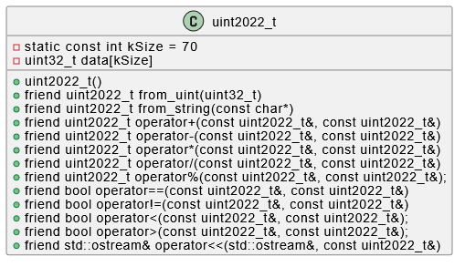

# uint2022_t: Пользовательский целочисленный тип фиксированной длины

## 🧾 Описание

`uint2022_t` — это пользовательский тип данных, реализующий беззнаковое целое число фиксированного размера (до 300 байт). Он позволяет безопасно оперировать значениями, превышающими стандартные границы целых типов C++.

Структура включает поддержку базовой арифметики, сравнения, преобразования из строки и чисел, а также форматированного вывода.

---

## 🔧 Возможности

- 🔄 Преобразование из `uint32_t`
- 📝 Преобразование из строки (`const char*`)
- ➕➖✖️➗ Арифметика: `+`, `-`, `*`, `/`, `%`
- ⚖️ Сравнение: `==`, `!=`, `<`, `>`
- 🖨️ Поддержка `std::ostream`

---

## 📁 Структура проекта

```
.
│   .gitignore
│   CMakeLists.txt
│   README.md             <-- Документация проекта
│
├───.vscode
│       settings.json
│
├───bin
│       CMakeLists.txt
│       main.cpp
│
├───images
│       struct.png        <-- Схема структуры
│
├───lib
│       CMakeLists.txt
│       number.cpp
│       number.h
│
└───tests
        CMakeLists.txt
        number_test.cpp
```

---

## 🧪 Запуск тестов

Проект использует **GoogleTest** для проверки корректности реализации. Тестируются:

- 📥 Преобразования из строки и числа
- 🧮 Арифметические действия
- 🔍 Операции сравнения (включая `<`, `>`)

### Как запустить:

```bash
mkdir build && cd build
cmake ..
cmake --build .
ctest
```

> ❗ Перед запуском убедитесь, что установлены **CMake** и **GoogleTest**.

---

## 🧱 Диаграмма структуры



---

## 📌 Ограничения

- 📦 Размер `uint2022_t` ≤ 300 байт
- 🔢 Только беззнаковые целочисленные значения

---

## 💡 Пример использования

```cpp
int main() {
    uint2022_t a = from_string("12345678901234567890");
    uint2022_t b = from_uint(42);

    std::cout << "a = " << a << std::endl;
    std::cout << "b = " << b << std::endl;

    std::cout << "a + b = " << (a + b) << std::endl;
    std::cout << "a > b? " << (a > b ? "Yes" : "No") << std::endl;

    return 0;
}
```

---

## 👤 Автор

- 👨‍💻 **Цароев Альберт Казбекович**
- 🧠 Язык: **C++**
- 🚀 Стандарты: **C++17 и выше**